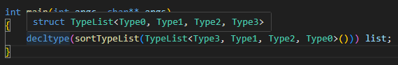

# Compile-Time Type Sorting

A template metaprogramming experiment to sort a list of types during compilation.

## Demo

Here you can see how the types get sorted.

## Use Cases

- **Entity Component Systems (ECS)**: Sorting component types to enable compile time archetypes. This could be used to gain a lot of performance when there is no need to find the archetype or table (FLECS) at runtime.

## Performance Note

> [!WARNING]
> Some features are currently disabled as they significantly increase compile times. This project pushes the boundaries of the C++ template engine.