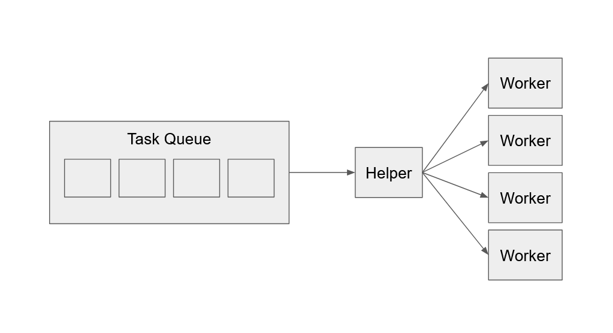

# Helper Task System

A high-performance multithreading task system designed for low-latency job execution.

## Architecture Overview

This system utilizes a **Dynamic Helper** pattern. Unlike static task systems the role `Helper` is fluid. A Helper can transition into a worker and help executing tasks, while another worker can promote itself to the Helper role when becomes idle. This ensures high system throughput and cpu utilization.

## Lock-Free Queues

### MPSC (Submission Queue)

A Multi-Producer-Single-Consumer queue acts as the central Mailbox. All threads can submit new jobs here. The **Dynamic Helper** is the single consumer of this queue, pulling the tasks and distributing them to the local worker queues.

### MPMC (Worker Queues)

Each thread has a local Multi-Producer-Multi-Consumer queue to support **Work-Stealing**. While the "Owner" consumes tasks to execute them, the **Dynamic Helper** can concurrently steal tasks from these queues to balance the load across all workers.

## More Features

- **Windows Futex**: Uses `WaitOnAddress` for fast synchronization.