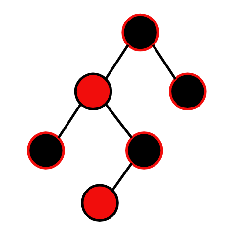

# Red-Black-Tree

A self-balancing binary search tree implementation focusing on performance.

## Features

- **Node-Based**: Fast insertion and deletion operations.
- **Balanced**: Ensures O(log n) search times.
- **Performance**: Optimized for frequent lookups and sorted traversal.

## Visualization

