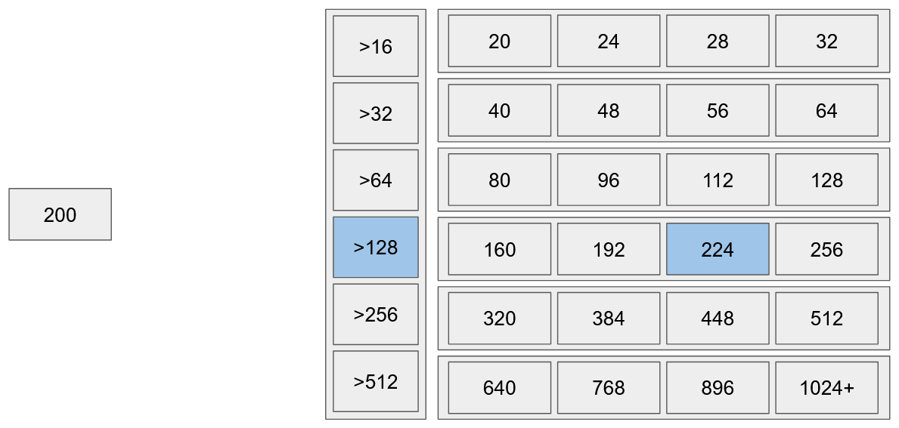

# TLSF Allocator

Implementation of a **Two Level Segregated Fit** memory allocation algorithm.

## Features

- **O(1) Performance**: Fast, constant-time allocation and deallocation.
- **Memory Efficient**: Supports best-fit memory allocation for low fragmentation.

## Overview

**Two Level Segregated Fit** allocation works by having free-lists for many sizes. A chunk of memory gets assigned the largest free-list it can satisfy. When allocating, you just have to look through bitmasks to find the smallest block of memory which can satisfy your needs. This is very fast and memory efficient.